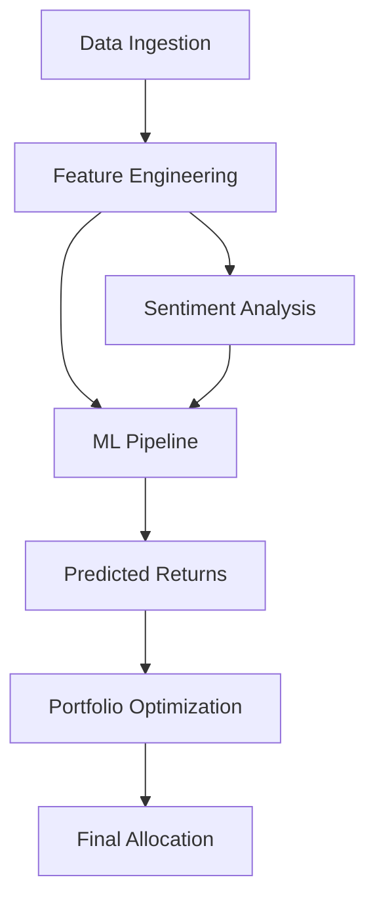

# Predict Equity

Predict Equity is a comprehensive stock return prediction and portfolio optimization system designed to leverage multi-dimensional data, including fundamental, technical, sentiment, and macroeconomic factors to forecast equity performance and construct optimized investment portfolios.

## Project Overview

The project follows a modular pipeline to:
1.  **Ingest** diverse data sources (Market, Fundamental, Sentiment, Macro).
2.  **Engineers** complex features across technical, financial, and economic domains.
3.  **Predict** stock returns using a high-performance XGBoost regression model.
4.  **Optimize** portfolio allocations based on risk-adjusted return metrics like the Sharpe and Sortino ratios.

## Architecture



## Data Sources

### 1. Market & Fundamentals
- **Historical Prices**: Fetched via `yfinance` for technical analysis.
- **Financial Statements**: Quarterly results, balance sheets, and cash flow statements sourced from Screener/Moneycontrol.
  - Data stored in: `quarterly/`, `balance_sheet/`, `cashflow/`

### 2. Sentiment Analysis
- **News Headlines**: Scraped using the `gnews` library.
- **Processing**: Financial-specific sentiment scoring using the **FinBERT** (`ProsusAI/finbert`) model from Hugging Face's Transformers.
  - Sentiment Score = `Prob(Positive) - Prob(Negative)`
  - Data stored in: `company_news_sentiment/`

### 3. Macroeconomic Data
- **Global Indicators**: Sourced in `macro.csv`, including:
  - VIX (Volatility Index), Crude Oil, Gold Price Returns, USDINR, S&P 500, Nifty 50.
  - Calculated spreads like the **Yield Gap** (10Y Bond Yield - Earnings Yield).

## Feature Engineering

The project engineers over 50+ features across three main pillars:

### Technical Indicators
- **Momentum**: RSI, MACD Histogram, Log Returns (1D, 5D, 20D, 60D).
- **Volatility**: Bollinger Bands, Drawdown, Rolling Volatility.
- **Volume**: Buying/Selling Pressure, Volume Attention (Volume / SMA_20).

### Fundamental Ratios
- **Growth**: Revenue, Profit, and EPS Growth YoY.
- **Efficiency**: DuPont Decomposition (Net Profit Margin, Asset Turnover, Equity Multiplier).
- **Valuation**: PE relative to 1Y average, Earnings Quality Ratio.

### Macro Factors
- **Spreads**: Yield Slope, Global Yield Spread.
- **Real Rates**: Domestic Yield - Inflation.
- **Relative Strength**: Gold-Oil Ratio, Global Equity Difference.

## Machine Learning Pipeline

- **Model**: `XGBRegressor` (XGBoost) tuned for regularization (`reg_alpha`, `reg_lambda`) and stability.
- **Feature Selection**: Recursive Feature Elimination (RFE) to identify the most predictive features.
- **Evaluation**: Validated using Root Mean Squared Error (RMSE) against a baseline model.
- **Target**: Predicted 20-day forward log returns.

## Portfolio Optimization

The final stage merges predicted returns for multiple tickers to find the optimal capital allocation.
- **Metrics**: Optimization targets the highest **Sharpe Ratio** and **Sortino Ratio**.
- **Portfolio Stats**: Calculates Annualized Return, Annualized Volatility, and Maximum Drawdown.

## Project Structure

- `src/`: Core Python scripts and Jupyter notebooks.
  - `process_data.py`: Main data cleaning and feature engineering utility.
  - `scrape_news_headlines.ipynb`: News ingestion.
  - `calculate_sentiment_scores.ipynb`: FinBERT implementation.
  - `train_model.ipynb`: Model training and feature selection.
  - `portfolio.ipynb`: Allocation optimization.
- `features/`: Processed feature sets for model training.
- `ticker_returns/`: Target variable data.
- `macro.csv`: Macroeconomic time-series data.

## Installation & Usage

1.  **Clone the repository**:
    ```bash
    git clone https://github.com/your-repo/Predict_Equity.git
    cd Predict_Equity
    ```
2.  **Install dependencies**:
    ```bash
    pip install -r requirements.txt
    ```
    *(Note: Project also uses `pyproject.toml` for metadata)*.
3.  **Run the pipeline**:
    - Execute `src/process_data.py` to prepare technical and fundamental data.
    - Run sentiment notebooks to generate news scores.
    - Execute `train_model.ipynb` to generate return predictions.
    - Optimize via `portfolio.ipynb`.
